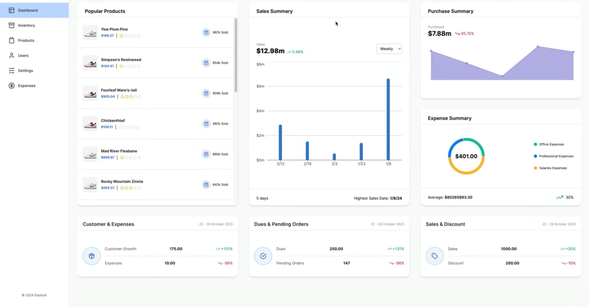
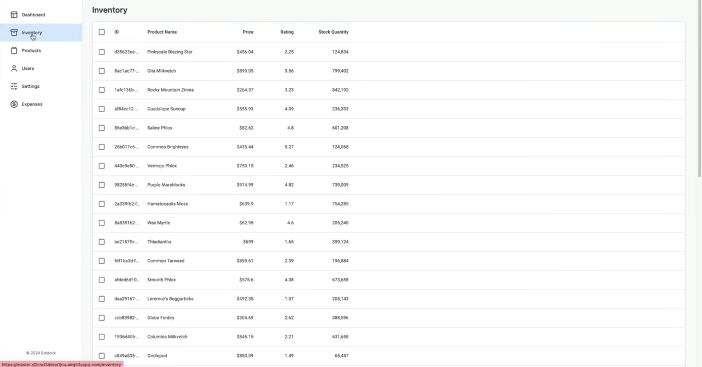
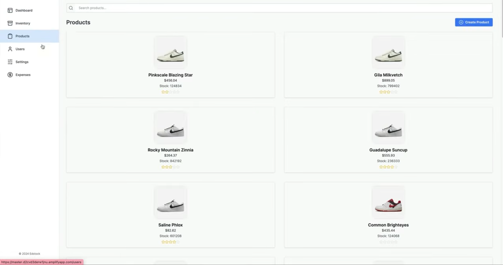
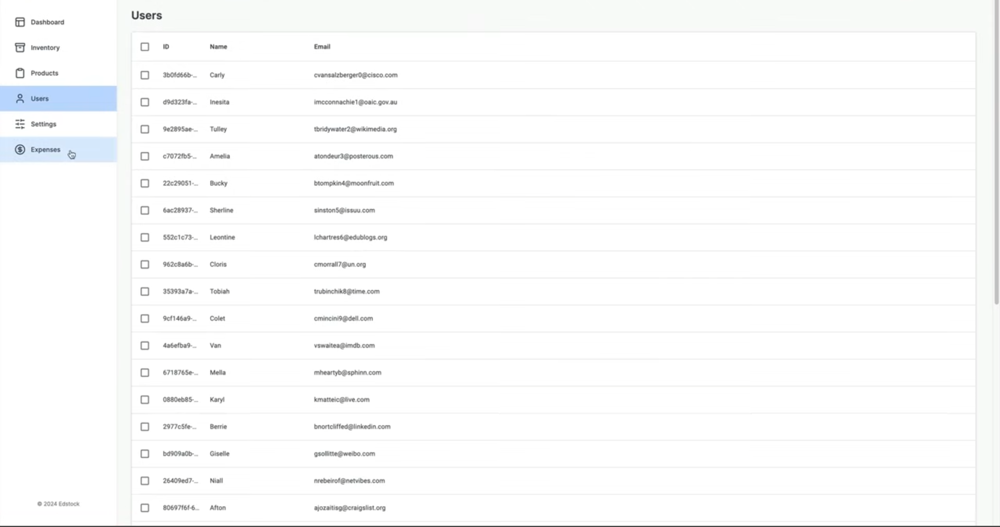
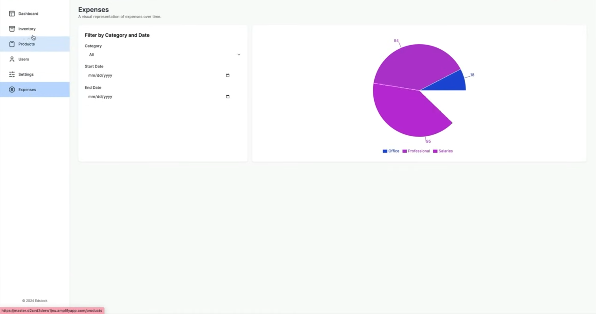
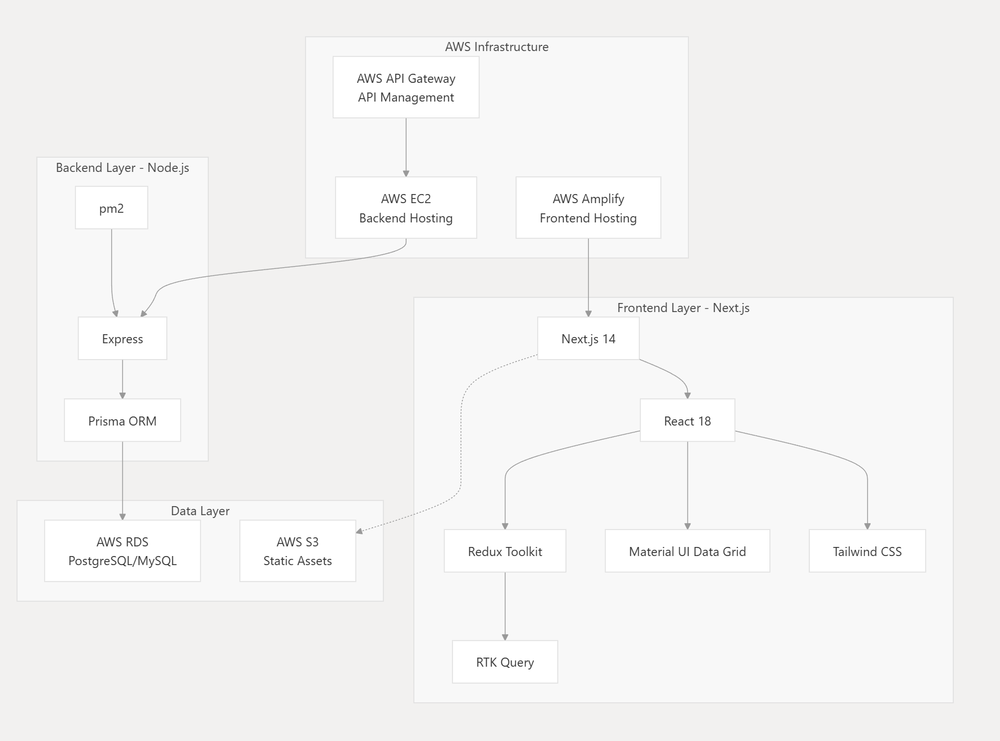
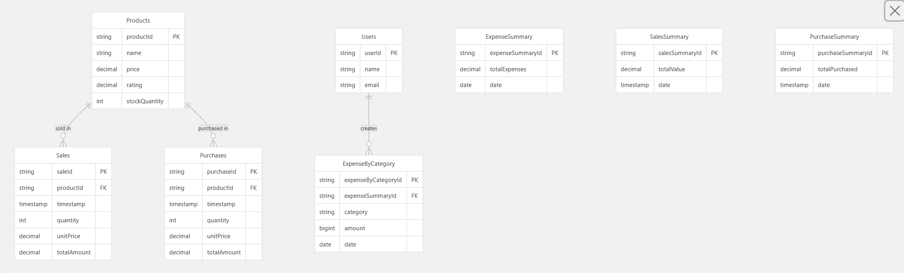

<h1>Inventory Management System</h1>

## 📘 Overview

<p>Inventory Management System — a full-stack application that helps businesses track stock, purchases, and sales while providing financial insights. Built with Next.js, TypeScript, and RTK Query on the frontend, with Express.js powering the backend. Recharts deliver interactive analytics, and the app is deployed on AWS (EC2, RDS, Amplify, API Gateway, S3) for scalability and reliability.</p>

---

## 📸 Dashboard Preview

<p align="center">
  <strong>1️⃣ Dashboard Overview</strong><br/>
  
</p>

<p align="center">
  <strong>2️⃣ Inventory</strong><br/>
  
</p>

<p align="center">
  <strong>3️⃣ Products</strong><br/>
  
</p>

<p align="center">
  <strong>4️⃣ Users</strong><br/>
  
</p>

<p align="center">
  <strong>5️⃣ Expenses</strong><br/>
  
</p>

---

## 📊 Example Insights

- Popular product (top sellers)
- Sales summary (daily / weekly / monthly)
- Purchase summary and supplier breakdown
- Expense summary & categories
- Discounts applied and impact on revenue
- Inventory levels & low-stock alerts
- Products catalogue overview
- Users / roles analytics
- Expense trends and forecasts

---

## 🛠️ Tech Stack

- Frontend: **Next.js**, **TypeScript**, **RTK Query**, **Recharts**
- Backend: **Express.js**, **Node.js**
- Database: **MongoDB** (or can swap to **Postgres** on RDS)
- Authentication: **JWT** (or OAuth support)
- DevOps / Hosting: **AWS EC2**, **RDS**, **Amplify**, **API Gateway**, **S3**

---

## 📂 Project Structure (example)

```
ai-finance-dashboard/
├─ client/ # Next.js frontend
│  ├─ public/
│  │  └─ Images/
│  ├─ src/
│  │  ├─ components/
│  │  ├─ pages/
│  │  ├─ features/
│  │  └─ styles/
│  ├─ package.json
│  └─ tsconfig.json
├─ server/ # Express backend
│  ├─ src/
│  │  ├─ controllers/
│  │  ├─ routes/
│  │  ├─ models/
│  │  └─ services/
│  ├─ tests/
│  ├─ package.json
│  └─ tsconfig.json
├─ infra/ # Deployment scripts, Terraform (optional)
├─ docker/
│  ├─ Dockerfile.client
│  └─ Dockerfile.server
├─ .github/
│  └─ workflows/
├─ README.md
└─ .env.example
```

---

## 🏗️ Project Architecture & Data Flow

<p align="center">
  <strong>1️⃣ Architecture Diagram</strong><br/>
  
</p>

<p align="center">
  <strong>2️⃣ Server Architecture</strong><br/>
  
</p>

<p align="center">
  <strong>3️⃣ Database Tables</strong><br/>
  
</p>

---

## ⚡ Getting Started

### Prerequisites

- Node.js (v18+) & npm / pnpm / yarn
- MongoDB (local or Atlas) or a managed DB (RDS)
- (Optional) Docker & Docker Compose

### Clone the repository

```bash
git clone <repository-url>
```

### Install dependencies

```bash
# from project root
cd client && npm install
cd ../server && npm install
```

### Run locally (development)

```bash
# start backend
cd server
npm run dev

# start frontend
cd ../client
npm run dev
```

---

## 🧾 Conclusion

This Inventory / AI-Finance Dashboard is designed to be modular and deployable. It provides real-time insights into sales, inventory, and expenses and is easily extensible to add ML-driven forecasts or third-party integrations.

---

<p align="center">Made with ❤️ · Built with Next.js + Express + TypeScript</p>
